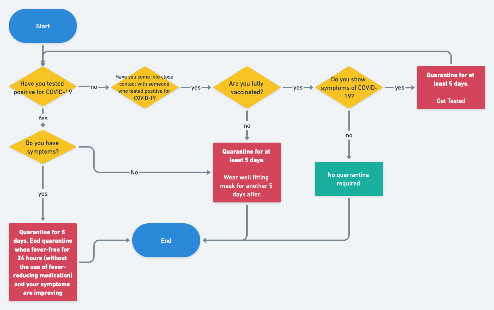

# Day 03

## Things to cover:

- connecting form input to state
- conditional rendering based on previous form data

## Recommender of quarantine or get tested

### fields

- first name
- last name
- age
- inputs from flowchart (see below).

### ouputs

- good to go,
- quarantine
- be cautious and wear mask

## homework

- extend the covid tester
- save form state to local storage so refresh keeps data
